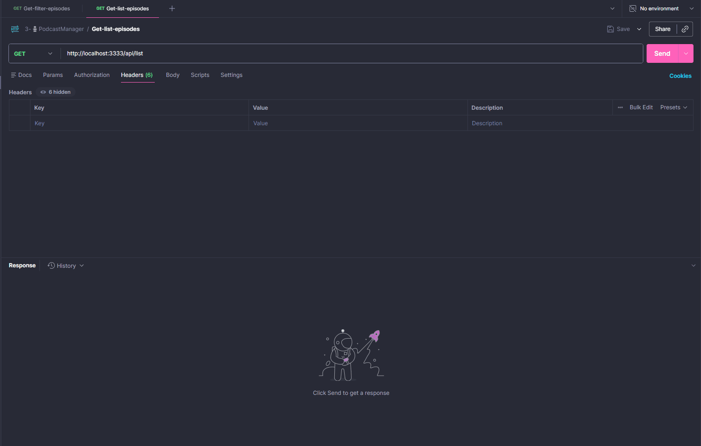

<h1 align="center"> Podcast Manager 🎧 </h1> 

A video podcast manager in a Netflix-style. An open-source project built with NodeJS + TypeScript + HTTP Module that provides an API to organize video podcasts. Episodes can be listed by categories and filtered by podcast name, including details such as cover image, link, and title. 🎬

  
  <a href="#-live-demo">Live Demo</a>&nbsp;&nbsp;&nbsp;|&nbsp;&nbsp;&nbsp;
  <a href="#-screenshots">Screenshots</a>&nbsp;&nbsp;&nbsp;|&nbsp;&nbsp;&nbsp;
  <a href="#-technologies">Technologies</a>&nbsp;&nbsp;&nbsp;|&nbsp;&nbsp;&nbsp;
  <a href="#-features">Features</a>&nbsp;&nbsp;&nbsp;|&nbsp;&nbsp;&nbsp;
  <a href="#-how-to-run">How to Run</a>&nbsp;&nbsp;&nbsp;|&nbsp;&nbsp;&nbsp;
  <a href="#-license">License</a>&nbsp;&nbsp;&nbsp;|&nbsp;&nbsp;&nbsp;
  <a href="#-contributing">Contributing</a>&nbsp;&nbsp;&nbsp;|&nbsp;&nbsp;&nbsp;
  <a href="#support">Support</a>  

  

 

## 🌐 Live Demo

  

  Tip: Use right-click → “Open in new tab”.

 

## 📸 Screenshots

 

  

 

## 🛠 Technologies

- TypeScript: Programming language used for the development of the project.
- Tsup: Build and bundling tool for TypeScript projects.
- Tsx: TypeScript runtime/compiler that supports building and running TypeScript projects.
- Node.js: JavaScript runtime environment that allows executing JavaScript code on the server side.
- @types/node: Type definition package for Node.js to assist development with TypeScript.

 

## ✨ Features

- List podcast episodes by category sections: Episodes are organized into categories such as health, bodybuilding, mindset, and humor, allowing users to easily explore the available content.
- Filter episodes by podcast name: Users can perform specific searches by podcast name, making it easier to access the desired episodes.

 

## ⚙ How to Run

- You need to have <kbd>[NodeJS](https://nodejs.org/en/download/)</kbd> installed on your machine.
- Clone the project.
- Install the dependencies using <kbd>npm install</kbd>
- Start the server by running <kbd>start:dev</kbd>
- Access the provided endpoints to list podcast episodes or filter them by podcast name.

 

